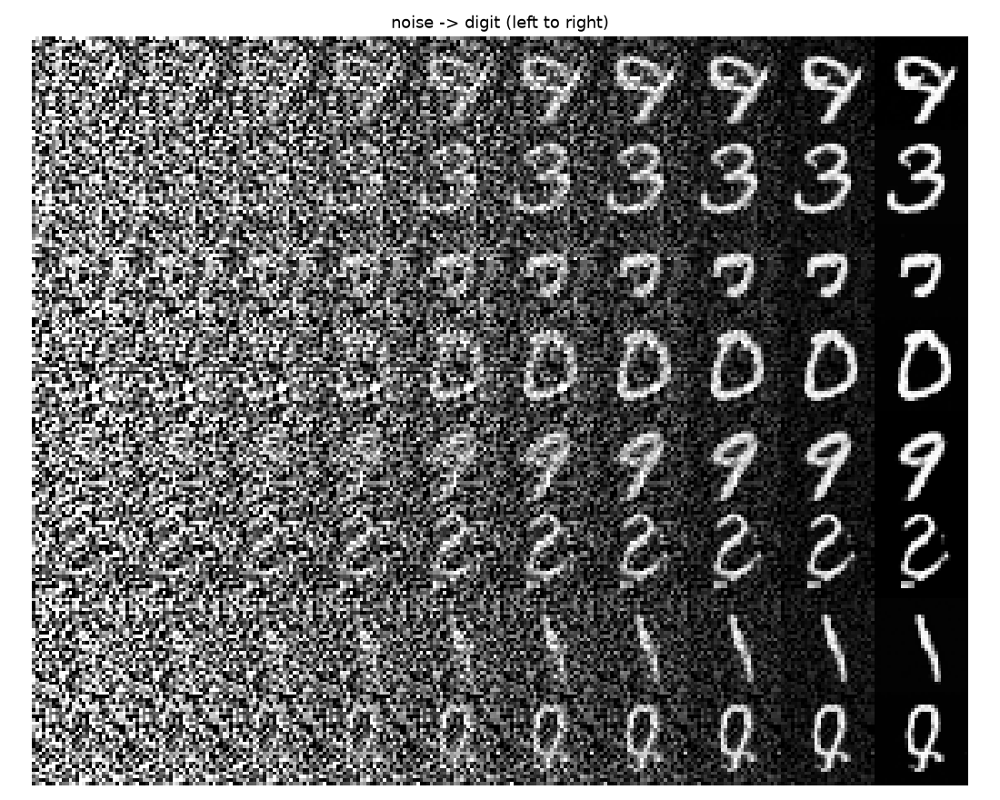

# fmx-flow-matching-mlx-demos

> Exploratory agentic engineering with Claude Opus 4.8.

Flow matching in
[MLX](https://github.com/ml-explore/mlx), on 2D toy distributions and MNIST.



Each row is one MNIST sample, integrated left (`t=0`, Gaussian noise) to right
(`t=1`, generated digit).

## Demos

Each demo is a [tyro](https://github.com/brentyi/tyro) CLI; try `--help`.

The 2D demos train in a few seconds; MNIST takes a few minutes on
an M4 Pro.

Checkpoints and plots in `outputs/`.

```bash
uv run examples/toy2d.py --dataset two_moons   # MLP on a 2D toy
uv run examples/mnist.py                        # UNet on MNIST
uv run examples/inspect_ckpt.py --ckpt outputs/mnist/ckpt
uv run examples/time_slider.py                  # scrub t on a trained image model
uv run examples/mnist_interactive.py            # live, retunable MNIST training
```

- **toy2d** — trains an MLP and saves a dashboard: velocity field, generated
  samples over the target, noise→data trajectories, and a step-count sweep.
- **mnist** — trains a UNet, checkpoints periodically so `time_slider` can load
  a run mid-training, and saves a sample/trajectory/loss dashboard.
- **inspect_ckpt** — weight and behaviour report for any checkpoint; flags a
  network that ignores `t` or `x` (the canonical silent flow-matching bug).
- **time_slider** — loads a trained image checkpoint and lets you drag `t` to see
  the ODE state `x_t` alongside the model's running guess of the final digit.
- **mnist_interactive** — a training loop you can pause, reset, and retune (learning
  rate, sampling steps) live from the keyboard.

## Module tree

Generated from the source by `generate_readme.py` (run via `uv run just`):

```
fmx
├── analytic
│   └── gaussian_marginal_field(
│           t: float,
│           x: mlx.core.array,
│           mu: mlx.core.array,
│           sigma: mlx.core.array,
│       ) -> mlx.core.array
├── checkpoint
│   ├── latest_ckpt()
│   ├── load()
│   └── save()
├── data
│   ├── mnist
│   │   ├── batch_sampler(
│   │   │       data: mlx.core.array,
│   │   │   ) -> collections.abc.Callable[[int], mlx.core.array]
│   │   └── load_mnist(cache: pathlib.Path) -> mlx.core.array
│   └── toy
│       ├── checkerboard(n: int) -> mlx.core.array
│       ├── eight_gaussians(n: int, std: float, radius: float) -> mlx.core.array
│       ├── spiral(n: int, noise: float, turns: float) -> mlx.core.array
│       ├── toy_sampler(
│       │       name: Literal[two_moons, eight_gaussians, spiral, checkerboard],
│       │   ) -> collections.abc.Callable[[int], mlx.core.array]
│       └── two_moons(n: int, noise: float) -> mlx.core.array
├── nets
│   ├── embed
│   │   └── fourier_time_embed(t: mlx.core.array, n_freqs: int) -> 
│   │       mlx.core.array
│   ├── mlp
│   │   ├── MLPConfig(dim: int, width: int, depth: int, n_time_freqs: int) -> 
│   │   │   None
│   │   └── VelocityMLP(cfg: MLPConfig)
│   └── unet
│       ├── ResBlock(in_ch: int, out_ch: int, t_dim: int, n_groups: int)
│       ├── TimeEmbed(n_freqs: int, dim: int)
│       ├── UNetConfig(
│       │       channels: int,
│       │       base: int,
│       │       ch_mults: tuple[int, ...],
│       │       n_time_freqs: int,
│       │       t_dim: int,
│       │       n_groups: int,
│       │   ) -> None
│       ├── Upsample(ch: int)
│       └── VelocityUNet(cfg: UNetConfig)
├── plot
│   ├── panel_loss(ax, history: list[tuple[int, float]]) -> None
│   ├── reveal(path: pathlib.Path, *, open_it: bool) -> None
│   ├── save_fig(fig, out: pathlib.Path, dpi: int) -> pathlib.Path
│   ├── image
│   │   ├── dashboard(
│   │   │       model: mlx.nn.layers.base.Module,
│   │   │       history,
│   │   │       out: pathlib.Path,
│   │   │       k: int,
│   │   │       n_steps: int,
│   │   │       seed: int,
│   │   │   ) -> pathlib.Path
│   │   ├── grid_canvas(samples: mlx.core.array, k: int) -> numpy.ndarray
│   │   ├── panel_grid(ax, samples: mlx.core.array, k: int) -> None
│   │   ├── panel_trajectory(
│   │   │       ax,
│   │   │       model: mlx.nn.layers.base.Module,
│   │   │       n_rows: int,
│   │   │       n_cols: int,
│   │   │       n_steps: int,
│   │   │       seed: int,
│   │   │   ) -> None
│   │   ├── sample_grid(
│   │   │       model: mlx.nn.layers.base.Module,
│   │   │       k: int,
│   │   │       n_steps: int,
│   │   │       seed: int,
│   │   │   ) -> mlx.core.array
│   │   └── save_trajectory_strip(
│   │           model: mlx.nn.layers.base.Module,
│   │           out: pathlib.Path,
│   │           n_rows: int,
│   │           n_cols: int,
│   │           n_steps: int,
│   │           seed: int,
│   │       ) -> pathlib.Path
│   └── toy
│       ├── dashboard(
│       │       model: mlx.nn.layers.base.Module,
│       │       data: mlx.core.array,
│       │       history,
│       │       out: pathlib.Path,
│       │       n_steps: int,
│       │   ) -> pathlib.Path
│       ├── panel_field(
│       │       ax,
│       │       model: mlx.nn.layers.base.Module,
│       │       t: float,
│       │       lim: float,
│       │       n: int,
│       │   ) -> None
│       ├── panel_samples(ax, gen: mlx.core.array, data: mlx.core.array, lim: 
│       │   float) -> None
│       ├── panel_step_sweep(
│       │       ax,
│       │       model: mlx.nn.layers.base.Module,
│       │       lim: float,
│       │       steps_list: tuple[int, ...],
│       │       n_samples: int,
│       │   ) -> None
│       └── panel_trajectories(ax, traj: mlx.core.array, lim: float, k: int) -> 
│           None
├── sample
│   └── sample(
│           model: mlx.nn.layers.base.Module,
│           x0: mlx.core.array,
│           *,
│           n_steps: int,
│           solver: Literal[euler, heun],
│       ) -> mlx.core.array
├── sanity
│   ├── behavior_report(
│   │       model: mlx.nn.layers.base.Module,
│   │       x: mlx.core.array,
│   │       ts: tuple[float, ...],
│   │   ) -> dict
│   ├── format_report(r: dict) -> str
│   ├── report(model: mlx.nn.layers.base.Module, x: mlx.core.array) -> dict
│   └── weight_report(model: mlx.nn.layers.base.Module) -> dict
└── train
    ├── fm_loss(
    │       model: mlx.nn.layers.base.Module,
    │       x0: mlx.core.array,
    │       x1: mlx.core.array,
    │       t: mlx.core.array,
    │   ) -> mlx.core.array
    ├── make_step(
    │       model: mlx.nn.layers.base.Module,
    │       opt: mlx.optimizers.optimizers.Optimizer,
    │       grad_clip: float,
    │   )
    ├── progress_line(step: int, metrics: dict) -> str
    └── train(
            model: mlx.nn.layers.base.Module,
            sampler: collections.abc.Callable[[int], mlx.core.array],
            *,
            steps: int,
            batch: int,
            lr: float,
            grad_clip: float,
            log_every: int,
            on_log: Optional[collections.abc.Callable[[int, dict], NoneType]],
        ) -> list[tuple[int, float]]
```
